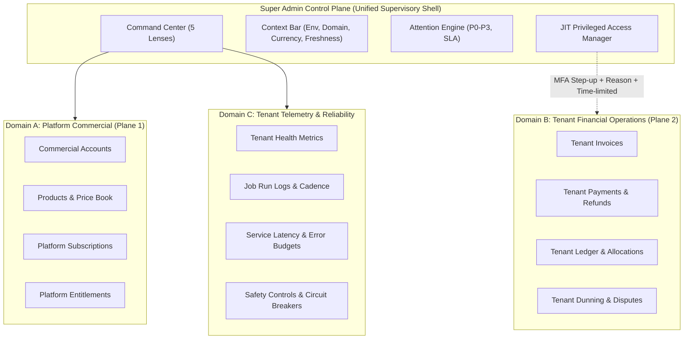

# Zoiko Billing Super Admin — Architecture Specification

**Document ID:** ZB-SA-ARCH-001  
**Authoritative Baseline:** ZB-SA-CMD-003 v3.0 / ZB-COM-BILL-001  
**Scope:** Super Admin Control Plane Architecture  
**Status:** Approved Baseline  

---

## 1. Domain Separation Architecture

The control plane enforces strict physical and logical isolation between three core domains:



### Non-Negotiable Invariants:
1. **No Domain A & B Mixture**: Platform Commercial accounts and tenant end-customer invoices never share database sequences, ledger tables, processor customers, or dashboard aggregations.
2. **No Direct Domain B Global Dropdowns**: Super admins cannot view tenant financial records through a global dropdown selector. Access requires an active, audited, time-limited `PrivilegedTenantAccessGrant` (JIT access) with step-up TOTP verification.
3. **Domain C Telemetry Purity**: Tenant telemetry consists solely of counts, health classifications, error rates, and job execution logs. Telemetry endpoints never return monetary figures.

---

## 2. Command Center Architecture & 5 Lenses

The Command Center is structured as a **Triage-First** administrative operations console with 5 progressive lenses. Each lens exposes a maximum of 4 primary modules.

```
+----------------------------------------------------------------------------------------------------+
| TOP CONTEXT BAR: [Env: PRODUCTION] [Domain] [Entity] [Region] [Currency] [Period] [Data as of: UTC] |
+----------------------------------------------------------------------------------------------------+
| ATTENTION QUEUE: P0/P1 Alerts, SLA Deadlines, Action Links | PRIVILEGED SESSIONS: Active JIT Grants |
+----------------------------------------------------------------------------------------------------+
| LENS SELECTOR: [ Triage (Default) ] [ Commercial ] [ Financial Ops ] [ Reliability ] [ Governance ] |
+----------------------------------------------------------------------------------------------------+
|                                                                                                    |
|  [ PRIMARY MODULE 1 ]      [ PRIMARY MODULE 2 ]      [ PRIMARY MODULE 3 ]      [ PRIMARY MODULE 4 ] |
|                                                                                                    |
+----------------------------------------------------------------------------------------------------+
| FOOTER STRIP: Recent Critical Events | Approval Queue Summary | Global Service Status              |
+----------------------------------------------------------------------------------------------------+
```

### Lens Specifications:
1. **Triage Lens (Default View)**:
   - **T1 Live Incidents**: Attention items filtered to P0/P1 active incidents with SLA countdowns.
   - **T2 Processing Pipeline**: 7-stage pipeline (Usage -> Rating -> Invoice Finalization -> Delivery -> Payment -> Settlement -> Reconciliation) with count, failure count, oldest age, and freshness.
   - **T3 Safety Controls**: Live status of domain circuit breakers with auto-expiry and blast-radius metadata.
   - **T4 Critical Event Stream**: Audited immutable event stream with actor, timestamp, action, and correlation ID.
2. **Commercial Lens**:
   - **C1 MRR Movement**: Monthly Recurring Revenue additions, expansions, contractions, churn.
   - **C2 Commercial Accounts**: Account status, billing classification, can_charge evaluation.
   - **C3 Platform Subscriptions**: Active/pending/suspended platform subscription inventory.
   - **C4 Platform Collections**: Collection efficiency and DSO tracking.
3. **Financial Operations Lens**:
   - **F1 Billings & Collections**: Invoiced vs collected trajectory, outstanding and overdue balances.
   - **F2 Payment Recovery**: Payment failure rate, dunning volume, recovery percentage.
   - **F3 Reconciliation & Integrity**: Composite verification state (coverage, verification timestamp, cadence, unmatched items, unallocated cash).
   - **F4 Revenue Leakage**: Unbilled usage, rating mismatches, unallocated credits.
4. **Reliability Lens**:
   - **R1 Service Health**: 9 core subsystems (Identity, Invoice, Notification, Payment, Ledger, Webhook, Subscription, Reconciliation, Reporting) with latency and error rates.
   - **R2 Integration Health**: Connector status, webhook delivery rates, processor ping times.
   - **R3 Queues & Jobs**: Background job execution logs, next scheduled run, failure count (24h).
   - **R4 SLO & Error Budget**: Uptime compliance against target SLOs.
5. **Governance Lens**:
   - **G1 Approval Center**: Maker-checker requests for price books, circuit breakers, and adjustments.
   - **G2 Privileged Access**: Active support grants, recent sessions, emergency break-glass log.
   - **G3 Audit & Evidence**: Immutable platform audit feed with correlation ID linking.
   - **G4 Release Control**: Production acceptance checklist and launch readiness verification.

---

## 3. Data Architecture & Freshness

1. **Governed Read Models (BFF)**:
   - React components consume pre-aggregated backend read models or dedicated telemetry endpoints.
   - Authoritative ledger calculations are strictly computed in backend domain services with ACID transactions.
2. **Independent Module Freshness**:
   - Every module tracks:
     - `last_successful_calculation`
     - `refresh_cadence`
     - `stale_threshold`
     - `unknown_threshold`
   - A failed or stale verification never defaults to HEALTHY. If verification is unverified or expired, status is **UNKNOWN**.
3. **Failure Isolation**:
   - Individual module failures render dedicated `DegradedStatCard` / `ErrorState` without crashing neighboring modules or the Command Center shell.
